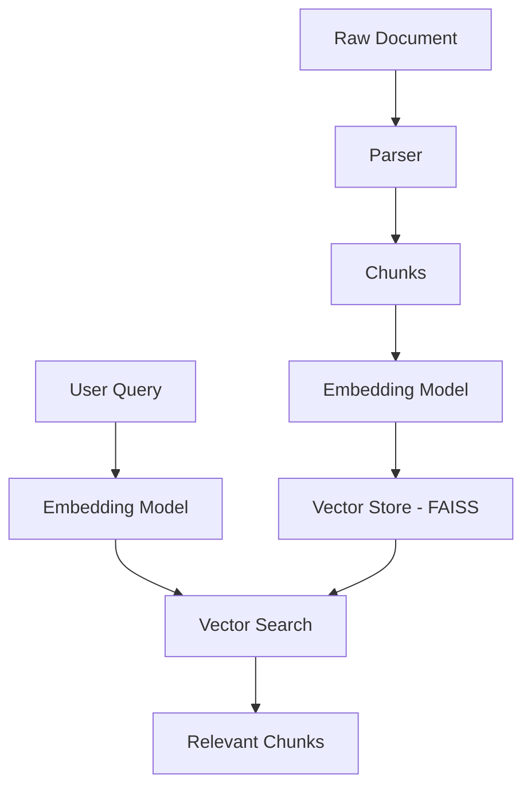

# Chapter 02: Vector Embeddings & Stores

In this chapter, we move beyond raw text parsing into **Semantic Understanding**. Instead of searching for keywords, we search for *meaning*.

## 1. The Core Concept: Vector Space
Think of embeddings as a way to turn human language into a coordinate system.
- "King" and "Queen" are close together in this space.
- "Apple" and "Banana" are also close together.
- "King" and "Apple" are far apart.

We use **Dense Vectors** (long lists of numbers) to represent these positions.

## 2. Our Architecture
We use a **Local-First** approach to keep things fast and free:

1.  **Embedding Model**: `sentence-transformers/all-MiniLM-L6-v2`
    - Small (80MB), fast, and surprisingly accurate.
    - Runs entirely on your CPU via `langchain-huggingface`.
2.  **Vector Store**: `FAISS` (Facebook AI Similarity Search)
    - Optimized for extremely fast similarity searches.
    - Stores vectors in a local folder (`vector_db/`), allowing the system to "remember" documents across sessions.

## 3. The Logic Flow


## 4. Why Bi-Encoders?
Currently, we use a **Bi-Encoder** architecture. 
- The query and documents are embedded *separately*.
- This allows us to search millions of documents in milliseconds.
- *Upcoming*: In Phase 4, we will introduce **Cross-Encoders** for re-ranking to achieve even higher precision.

## 5. Usage
To index a file and search it semantically:
```python
from src.app import LangChainAgent

agent = LangChainAgent()
# Index a file
agent.index_file("testdata/sample_pdf.pdf")

# Search by meaning
results, logs = agent.search_documents("What is the main topic?")
for doc in results:
    print(doc.page_content)
```
